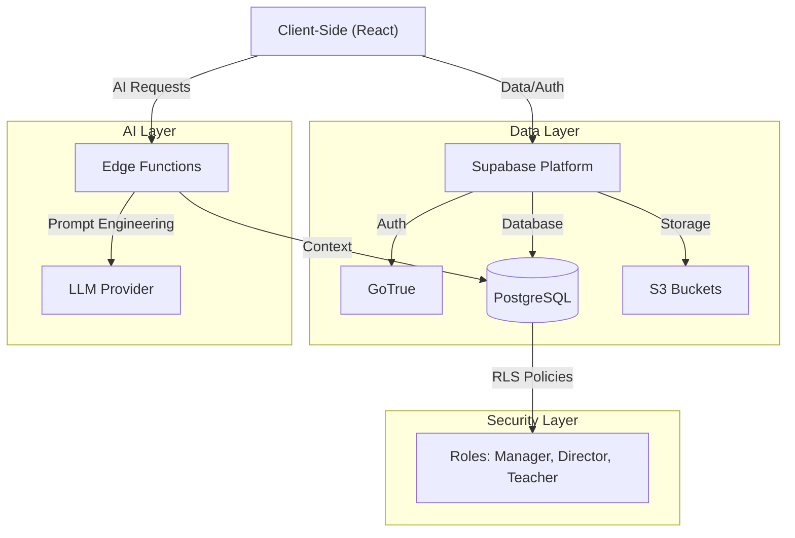

# Aprendu | Inteligência Estratégica para Redes de Ensino


**Aprendu** é uma plataforma integrada de gestão educacional (EdTech) desenhada para transformar dados dispersos em inteligência estratégica. O sistema conecta a gestão Regional, Diretores Escolares, Professores e Alunos em um ecossistema unificado, eliminando ilhas de informação e permitindo intervenções pedagógicas baseadas em dados em tempo real.

---

##  Proposta de Valor

Diferente dos sistemas acadêmicos legados (ERP), o Aprendu foca em **Analytics e Sucesso do Aluno**:
*   **Predictive Analytics:** Identificação precoce de risco de evasão escolar.
*   **Gestão de Infraestrutura:** Monitoramento centralizado da saúde física de multiplas unidades escolares.
*   **Eficiência Operacional:** Automação de Censo, Chamada e Planejamento de Aulas com IA.

---

##  Arquitetura do Sistema

O sistema opera sob o princípio de *"Single Source of Truth"* (Fonte Única da Verdade), onde dados coletados na ponta (escola) alimentam instantaneamente os painéis estratégicos (regional).

### Módulos Principais

#### 1.  Dashboard Regional (Secretaria de Educação)
*Visão macroestratégica para gestores públicos.*
*   **Intelligent Copilot:** Assistente de IA que gera relatórios executivos sobre dados da rede.
*   **Infrastructure Score:** Monitoramento em tempo real das condições físicas das escolas (Gauge Charts).
*   **Heatmaps de Desempenho:** Visualização geográfica de déficits de aprendizagem por região.
*   **Campanhas de Clima:** Gestão de pesquisas de satisfação (NPS) em larga escala.

#### 2.  Portal do Diretor (Gestão Escolar)
*Ferramentas táticas para a liderança da unidade.*
*   **Gestão Financeira:** Controle de Obras, Reformas e Orçamento (Visual Enterprise).
*   **Censo Automatizado:** Fluxo de inventário integrado que calcula automaticamente a nota de infraestrutura da escola.
*   **Monitoramento de Turmas:** Acompanhamento de frequência e desempenho por série.

#### 3.  Painel do Professor (Sala de Aula)
*Produtividade e foco no ensino.*
*   **Chamada Digital:** Registro rápido de presença com cálculo automático de risco de evasão.
*   **Planejador de Aulas com IA:** Geração automática de roteiros de aula alinhados à BNCC.
*   **Análise de Progresso:** Feedback visual sobre o desempenho individual de cada aluno.

---

##  Mapa Tecnológico e Arquitetura

O sistema adota uma arquitetura **Híbrida**:
*   **Frontend Checkpoint:** Hospedado na **Hostinger**.
*   **Backend Intelligence:** **Serverless** via Supabase (Banco de dados, Auth e IA sem gestão de servidores).



### Stack Detalhada
*   **Frontend:** React 18, TypeScript, Vite.
*   **UI System:** Shadcn/UI + Tailwind CSS.
*   **Backend:** Supabase (BaaS).
*   **Database:** PostgreSQL 16 com extensões (pgvector para IA futura).
*   **Compute:** Edge Functions (Deno).

---

##  Instalação e Execução Local

Pré-requisitos: Node.js 18+ e npm.

```bash
# 1. Clone o repositório
git clone https://github.com/omni-mind/educai-gyn.git

# 2. Instale as dependências
npm install

# 3. Configure as variáveis de ambiente
# Crie um arquivo .env com suas chaves do Supabase
# VITE_SUPABASE_URL=...
# VITE_SUPABASE_ANON_KEY=...

# 4. Configuração do Banco de Dados (Supabase)
# O projeto utiliza Supabase como backend. Para replicar o ambiente:
# 1. Crie um projeto no Supabase Dashboard
# 2. Copie as chaves para o arquivo .env
# 3. Execute os scripts SQL localizados na pasta `supabase/migrations` no Editor SQL do Supabase
#    (Recomendado executar na ordem cronológica)

# 5. Inicie o servidor de desenvolvimento
npm run dev
```

##  Primeiros Passos e Seed de Dados (Ambiente de Desenvolvimento)
> **Nota de Segurança:** Os passos abaixo destinam-se exclusivamente à configuração de um ambiente de desenvolvimento local (`localhost`). Em produção, o provisionamento de usuários é gerido via painel administrativo seguro ou integração via SSO, nunca por inserção direta no banco.

1.  **Criar Usuário de Teste:** No painel local ou dashboard de QA, crie um usuário.
2.  **Atribuição de Papel (Role):** Para fins de *debug*, associe um perfil via SQL:
    ```sql
    -- APENAS PARA DESENVOLVIMENTO
    INSERT INTO public.profiles (id, email, role, full_name)
    VALUES ('USER_UUID', 'dev@local', 'regional_manager', 'Dev Admin');
    ```

3.  **Edge Functions (IA):** Para testar as funcionalidades de IA (Copilot), certifique-se de que a função `generate-lesson-plan` está deployada ou rodando localmente via Supabase CLI:
    ```bash
    supabase functions serve
    ```

##  Segurança e Privacidade
O projeto implementa **Row Level Security (RLS)** no banco de dados, garantindo que:
*   Professores acessam apenas suas turmas.
*   Diretores acessam apenas sua escola.
*   Gestores Regionais têm visão agregada (anonimizada onde necessário).

---

**Desenvolvido por Omni Mind** - *Transformando Educação com Dados.*
