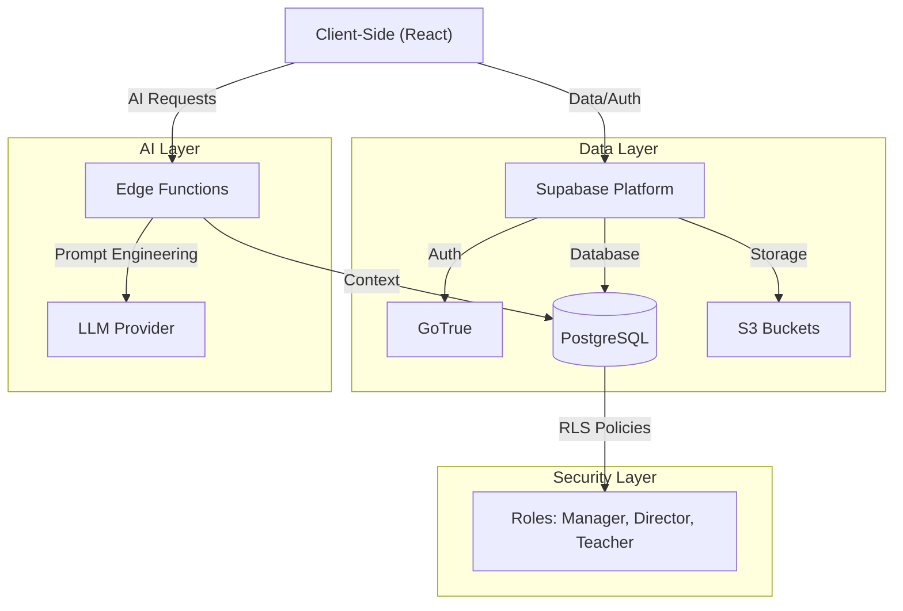

# Aprendu | Inteligência Estratégica para Redes de Ensino


**Aprendu** é uma plataforma integrada de gestão educacional (EdTech) desenhada para transformar dados dispersos em inteligência estratégica. O sistema conecta a gestão Regional, Diretores Escolares, Professores e Alunos em um ecossistema unificado, eliminando ilhas de informação e permitindo intervenções pedagógicas baseadas em dados em tempo real.

---

## Índice

- [Proposta de Valor](#proposta-de-valor)
- [Arquitetura do Sistema](#arquitetura-do-sistema)
- [Stack Tecnológica](#stack-tecnológica)
- [Estrutura do Projeto](#estrutura-do-projeto)
- [Diagrama de Arquitetura](#diagrama-de-arquitetura)
- [Instalação e Execução Local](#instalação-e-execução-local)
- [Primeiros Passos](#primeiros-passos-ambiente-de-desenvolvimento)
- [Segurança e Privacidade](#segurança-e-privacidade)
- [Contribuindo](#contribuindo)
- [Scripts Disponíveis](#scripts-disponíveis)

---

## Proposta de Valor

Diferente dos sistemas acadêmicos legados (ERP), o Aprendu foca em **Analytics e Sucesso do Aluno**:

| Pilar | Descrição |
|-------|-----------|
| **Predictive Analytics** | Identificação precoce de risco de evasão escolar |
| **Gestão de Infraestrutura** | Monitoramento centralizado da saúde física de múltiplas unidades escolares |
| **Eficiência Operacional** | Automação de Censo, Chamada e Planejamento de Aulas com IA |

---

## Arquitetura do Sistema

O sistema opera sob o princípio de *"Single Source of Truth"* (Fonte Única da Verdade), onde dados coletados na ponta (escola) alimentam instantaneamente os painéis estratégicos (regional).

### Módulos Principais

<details>
<summary><strong>Dashboard Regional (Secretaria de Educação)</strong></summary>

*Visão macroestratégica para gestores públicos.*

| Funcionalidade | Descrição |
|----------------|-----------|
| Intelligent Copilot | Assistente de IA que gera relatórios executivos sobre dados da rede |
| Infrastructure Score | Monitoramento em tempo real das condições físicas das escolas |
| Heatmaps de Desempenho | Visualização geográfica de déficits de aprendizagem por região |
| Campanhas de Clima | Gestão de pesquisas de satisfação (NPS) em larga escala |

</details>

<details>
<summary><strong>Portal do Diretor (Gestão Escolar)</strong></summary>

*Ferramentas táticas para a liderança da unidade.*

| Funcionalidade | Descrição |
|----------------|-----------|
| Gestão Financeira | Controle de Obras, Reformas e Orçamento |
| Censo Automatizado | Fluxo de inventário integrado que calcula a nota de infraestrutura |
| Monitoramento de Turmas | Acompanhamento de frequência e desempenho por série |

</details>

<details>
<summary><strong>Painel do Professor (Sala de Aula)</strong></summary>

*Produtividade e foco no ensino.*

| Funcionalidade | Descrição |
|----------------|-----------|
| Chamada Digital | Registro rápido de presença com cálculo automático de risco de evasão |
| Planejador de Aulas com IA | Geração automática de roteiros de aula alinhados à BNCC |
| Análise de Progresso | Feedback visual sobre o desempenho individual de cada aluno |

</details>

---

## Stack Tecnológica

| Tecnologia | Versão | Descrição |
|------------|--------|-----------|
| React | 18.3 | Biblioteca de UI |
| TypeScript | 5.8 | Tipagem estática |
| Vite | 5.4 | Build tool |
| Supabase | 2.89 | Backend as a Service |
| PostgreSQL | 16 | Banco de dados (via Supabase) |
| Tailwind CSS | 3.4 | Framework de estilos |
| Shadcn/UI | - | Componentes de UI |
| Deno | - | Runtime para Edge Functions |

---

## Estrutura do Projeto

```
src/
├── components/        # Componentes React (UI)
│   ├── dashboard/     # Dashboards por perfil (Director, Teacher, Student, etc.)
│   └── ui/            # Componentes base (Shadcn)
├── hooks/             # Custom Hooks
│   └── dashboard/     # Hooks específicos de cada dashboard
├── services/          # Camada de serviços (API calls, Supabase)
├── types/             # Definições TypeScript
├── constants/         # Dados estáticos e configurações
├── pages/             # Páginas/Rotas
└── integrations/      # Integrações externas (Supabase client)

supabase/
├── functions/         # Edge Functions (Deno)
│   └── _shared/       # Código compartilhado entre functions
└── migrations/        # Scripts SQL de migração
```

---

## Diagrama de Arquitetura



---

## Instalação e Execução Local

**Pré-requisitos:** Node.js 22+ e npm.

```bash
# 1. Clone o repositório
git clone https://github.com/omni-mind/educai-gyn.git

# 2. Instale as dependências
npm install

# 3. Configure as variáveis de ambiente
# Crie um arquivo .env com suas chaves do Supabase
# VITE_SUPABASE_URL=...
# VITE_SUPABASE_ANON_KEY=...

# 4. Inicie o servidor de desenvolvimento
npm run dev
```

<details>
<summary><strong>Configuração do Banco de Dados (Supabase)</strong></summary>

O projeto utiliza Supabase como backend. Para replicar o ambiente:

1. Crie um projeto no [Supabase Dashboard](https://supabase.com/dashboard)
2. Copie as chaves para o arquivo `.env`
3. Execute os scripts SQL localizados em `supabase/migrations` no Editor SQL do Supabase (ordem cronológica)

</details>

<details>
<summary><strong>Edge Functions (IA)</strong></summary>

Para testar as funcionalidades de IA (Copilot), certifique-se de que as funções estão deployadas ou rodando localmente:

```bash
supabase functions serve
```

</details>

---

## Primeiros Passos (Ambiente de Desenvolvimento)

> **Nota de Segurança:** Os passos abaixo destinam-se exclusivamente à configuração de um ambiente de desenvolvimento local. Em produção, o provisionamento de usuários é gerido via painel administrativo seguro.

1. **Criar Usuário de Teste:** No painel local ou dashboard de QA, crie um usuário.
2. **Atribuição de Papel (Role):** Para fins de debug, associe um perfil via SQL:

```sql
-- APENAS PARA DESENVOLVIMENTO
INSERT INTO public.profiles (id, email, role, full_name)
VALUES ('USER_UUID', 'dev@local', 'regional_manager', 'Dev Admin');
```

---

## Segurança e Privacidade

O projeto implementa **Row Level Security (RLS)** no banco de dados:

| Perfil | Acesso |
|--------|--------|
| Professor | Apenas suas turmas |
| Diretor | Apenas sua escola |
| Gestor Regional | Visão agregada (anonimizada onde necessário) |

---

## Contribuindo

### Branches

| Prefixo | Propósito |
|---------|-----------|
| `main` | Produção estável |
| `feat/*` | Novas funcionalidades |
| `feature/*` | Novas funcionalidades (alternativo) |
| `refactor/*` | Melhorias de código e organização |
| `fix/*` | Correções de bugs |

### Padrão de Commits

Utilizamos [Conventional Commits](https://www.conventionalcommits.org/). O formato é:

```
<tipo>: <descrição curta>
```

**Tipos disponíveis:**

| Tipo | Quando usar |
|------|-------------|
| `feat` | Nova funcionalidade para o usuário |
| `fix` | Correção de bug |
| `refactor` | Reestruturação de código sem mudar comportamento |
| `docs` | Alterações em documentação |
| `chore` | Tarefas de manutenção (deps, configs) |
| `style` | Formatação, espaços, ponto-e-vírgula |
| `test` | Adição ou correção de testes |

<details>
<summary><strong>Exemplos reais deste projeto</strong></summary>

```bash
# Refatoração de componentes
refactor: modularize Coordinator Dashboard (service/mock, hook, components)
refactor: modularize Secretary Dashboard (service, hook, components)
refactor: modularize Student Dashboard (extract views to components)

# Correção de bugs
fix: update chat-ai model to gpt-4o-mini and cleanup imports

# Manutenção
chore: update Dockerfile to node:22 and improve README documentation
```

</details>

### Pull Requests

1. Crie uma branch a partir de `main`
2. Faça suas alterações
3. Execute `npm run build` e `npm run lint`
4. Abra um PR para `main` com descrição clara

---

## Scripts Disponíveis

| Comando | Descrição |
|---------|-----------|
| `npm run dev` | Inicia servidor de desenvolvimento |
| `npm run build` | Gera build de produção |
| `npm run lint` | Executa verificação de código |
| `npm run preview` | Preview do build de produção |

---

**Desenvolvido por Omni Mind** - *Transformando Educação com Dados.*
